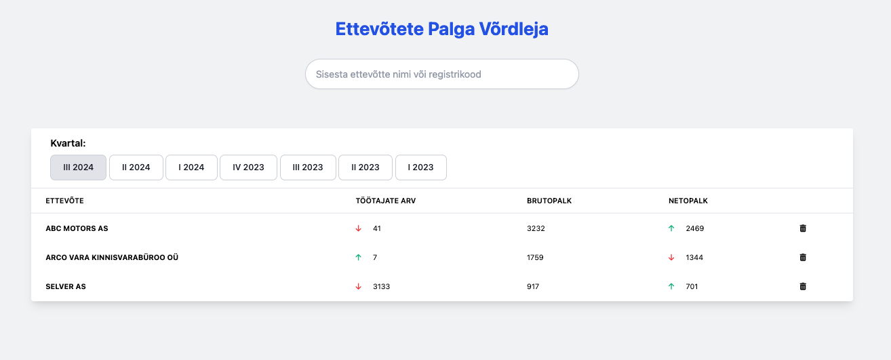

# Maksuamet - Estonian Company Average Pay Comparator

Welcome to **Maksuamet**! This application allows you to explore and compare the average pay across different companies in Estonia. You can view each company's average pay, add multiple companies to a comparison, and see how their salaries have changed from previous quarters — with intuitive emoji indicators to help visualize the trends!



## Features

- **Company Average Pay Comparison**: Easily compare the average salaries of various companies in Estonia.
- **Quarterly Performance Indicators**: Get a clear picture of how each company's average pay and employee count has changed compared to the previous quarter using emojis.
  - ⬆️ **Increase**: Salary/employee count increased compared to the previous quarter.
  - ⬇️ **Decrease**: Salary/employee count decreased compared to the previous quarter.
  - **No Change**: Salary/employee count remained the same.
- **Add Multiple Companies**: Add several companies to see a side-by-side comparison of their average pay.

## Getting Started

### Prerequisites
- Java 17 or higher
- PostgreSQL database
- Docker (optional, for containerized deployment)

### Installation
1. Clone the repository:
   ```bash
   git clone https://github.com/MathiasRanna/Maksuamet.git
   cd Maksuamet
   ```

2. Build the project using Maven:
   ```bash
   mvn clean package
   ```

3. Run the application:
   ```bash
   java -jar target/Maksuamet-1.0.0.jar
   ```

### Running with Docker Compose
To run the application along with the database using Docker Compose:

```bash
docker-compose up --build
```

## Usage
- Navigate to the main page where you can search for companies by their name or registry code.
- Add multiple companies to compare their average pay for the current quarter.
- Observe the trend emojis that indicate whether a company's average pay has increased, decreased, or remained the same compared to the previous quarter.

## Technology Stack
- **Backend**: Java, Spring Boot, JPA (Hibernate), PostgreSQL
- **Frontend**: Thymeleaf, JavaScript
- **Build Tools**: Maven, Docker

## Contributing
Contributions are welcome! Feel free to open an issue or submit a pull request for any feature suggestions or bug fixes.

## License
This project is licensed under the MIT License - see the [LICENSE](LICENSE) file for details.


